# 💜⚡ SilkCircuit: Electric Meets Elegant

<div align="center">

[](https://github.com/hyperb1iss/silkcircuit)
[](https://hyperb1iss.github.io/silkcircuit/)
[](https://www.w3.org/WAI/WCAG21/quickref/)
[](https://opensource.org/licenses/MIT)

[](https://neovim.io/)
[](https://marketplace.visualstudio.com/items?itemName=hyperb1iss.silkcircuit-theme)
[](https://chromewebstore.google.com/)

🌌 _A vibrant cyberpunk color system for your entire dev environment._ 🎆

[⚡ Quick Start](#-quick-start) · [💜 Neovim](#-neovim) · [🎨 Variants](#-variants) · [🌃 Full Ecosystem](#-full-ecosystem) · [📖 Documentation](https://hyperb1iss.github.io/silkcircuit/)

</div>

<div align="center">
  
</div>

<br>

<div align="center">
  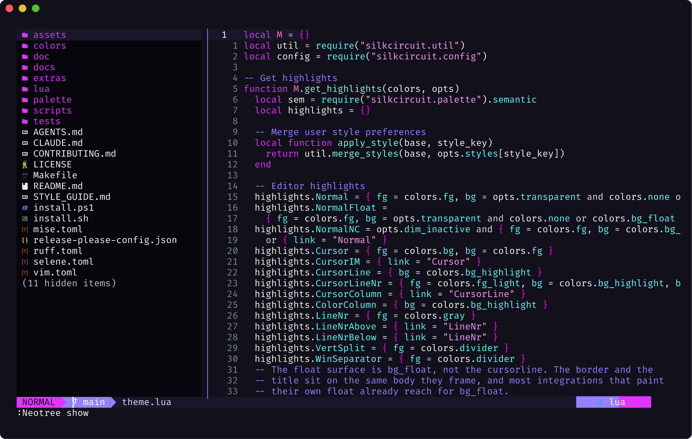
</div>

## 🎭 What Is SilkCircuit?

One palette, one semantic system, five intensity variants, every tool in your workflow. SilkCircuit themes editors, terminals, browsers, system monitors, and CLI tools with consistent colors and WCAG AA contrast ratios across the board.

### 🌐 Platforms

| Category            | Targets                                                                  |
| ------------------- | ------------------------------------------------------------------------ |
| 💻 **Editors**      | Neovim (39 plugin integrations), VS Code (Marketplace), AstroNvim, Helix |
| 🖥️ **Terminals**    | Ghostty, Kitty, Alacritty, WezTerm, foot, iTerm2, Warp, Windows Terminal |
| 🪟 **Multiplexers** | tmux, Zellij                                                             |
| 🌐 **Browsers**     | Chrome (Web Store, 5 variants + DevTools CSS)                            |
| 🔧 **CLI Tools**    | btop, K9s, lazygit, bat, fzf, lsd, procs, atuin, Starship                |
| ⚙️ **System**       | COSMIC Desktop, fastfetch, dmesg                                         |
| 🎯 **Other**        | Git (delta integration), Slack, Lualine                                  |

### 🎛️ Variants

Five intensity levels, all using the same underlying palette:

| Variant        | Style                       | Best For               |
| -------------- | --------------------------- | ---------------------- |
| ⚡ **Neon**    | 100% saturated              | Maximum vibrancy       |
| 🔮 **Vibrant** | 85% intensity               | Balanced energy        |
| 🌸 **Soft**    | 70% intensity               | Extended sessions      |
| 🌌 **Glow**    | Ultra-dark bg, pure neon fg | Low-light / OLED       |
| 🌅 **Dawn**    | Light theme                 | Daytime & bright rooms |

## 🪄 Quick Start

### ⚡ Universal Installer

The fastest way to theme everything at once. It detects your installed tools, drops each theme where that tool looks for it, prints the one line that turns it on, and backs up anything it replaces:

```bash
git clone https://github.com/hyperb1iss/silkcircuit.git
cd silkcircuit
./install.sh --dry-run     # see what it would touch
./install.sh               # all five variants, side by side
./install.sh --variant glow
```

```powershell
git clone https://github.com/hyperb1iss/silkcircuit.git
cd silkcircuit
powershell -ExecutionPolicy Bypass -File .\install.ps1 -Variant neon
```

### 🎯 Individual Platforms

Pick what you need:

<details open>
<summary><b>🔮 Neovim</b> (lazy.nvim)</summary>

```lua
{
  "hyperb1iss/silkcircuit",
  lazy = false,
  priority = 1000,
  config = function()
    vim.cmd.colorscheme("silkcircuit")
  end,
}
```

</details>

<details>
<summary><b>📦 Neovim</b> (packer.nvim)</summary>

```lua
use {
  "hyperb1iss/silkcircuit",
  config = function()
    vim.cmd("colorscheme silkcircuit")
  end
}
```

</details>

<details>
<summary><b>🔌 Neovim</b> (vim-plug)</summary>

```vim
Plug 'hyperb1iss/silkcircuit'
colorscheme silkcircuit
```

</details>

<details>
<summary><b>💎 VS Code</b></summary>

Install from the [VS Code Marketplace](https://marketplace.visualstudio.com/items?itemName=hyperb1iss.silkcircuit-theme), or:

```bash
code --install-extension hyperb1iss.silkcircuit-theme
```

</details>

<details>
<summary><b>🌐 Chrome</b></summary>

Available on the Chrome Web Store (all 5 variants), or load unpacked:

```bash
make chrome
# chrome://extensions/ → Developer mode → Load unpacked
# Select: extras/chrome-theme/silkcircuit-{variant}/
```

</details>

<details>
<summary><b>🖥️ Terminals</b></summary>

Every terminal ships all five variants, rendered from the same palette Neovim
uses. The [terminal guide](docs/extras/terminals.md) has the install line for
each one.

<!-- extras:start -->

| Target                          | Format                                                                                             | Generated files                                                                                                                                                                                                                                                                             |
| ------------------------------- | -------------------------------------------------------------------------------------------------- | ------------------------------------------------------------------------------------------------------------------------------------------------------------------------------------------------------------------------------------------------------------------------------------------- |
| Alacritty                       | [reference](https://alacritty.org/config-alacritty.html#colors)                                    | [neon](extras/alacritty/silkcircuit-neon.toml) · [vibrant](extras/alacritty/silkcircuit-vibrant.toml) · [soft](extras/alacritty/silkcircuit-soft.toml) · [glow](extras/alacritty/silkcircuit-glow.toml) · [dawn](extras/alacritty/silkcircuit-dawn.toml)                                    |
| Atuin                           | [reference](https://github.com/atuinsh/atuin/blob/main/crates/atuin-client/src/theme.rs)           | [neon](extras/atuin/silkcircuit-neon.toml) · [vibrant](extras/atuin/silkcircuit-vibrant.toml) · [soft](extras/atuin/silkcircuit-soft.toml) · [glow](extras/atuin/silkcircuit-glow.toml) · [dawn](extras/atuin/silkcircuit-dawn.toml)                                                        |
| bat                             | [reference](https://github.com/sharkdp/bat#adding-new-themes)                                      | [neon](extras/bat/silkcircuit-neon.tmTheme) · [vibrant](extras/bat/silkcircuit-vibrant.tmTheme) · [soft](extras/bat/silkcircuit-soft.tmTheme) · [glow](extras/bat/silkcircuit-glow.tmTheme) · [dawn](extras/bat/silkcircuit-dawn.tmTheme)                                                   |
| btop                            | [reference](https://github.com/aristocratos/btop#themes)                                           | [neon](extras/btop/silkcircuit-neon.theme) · [vibrant](extras/btop/silkcircuit-vibrant.theme) · [soft](extras/btop/silkcircuit-soft.theme) · [glow](extras/btop/silkcircuit-glow.theme) · [dawn](extras/btop/silkcircuit-dawn.theme)                                                        |
| COSMIC Desktop                  | [reference](https://github.com/pop-os/cosmic-theme)                                                | [neon](extras/cosmic/silkcircuit-neon.ron) · [vibrant](extras/cosmic/silkcircuit-vibrant.ron) · [soft](extras/cosmic/silkcircuit-soft.ron) · [glow](extras/cosmic/silkcircuit-glow.ron) · [dawn](extras/cosmic/silkcircuit-dawn.ron)                                                        |
| GNU dircolors                   | [reference](https://man7.org/linux/man-pages/man1/dircolors.1.html)                                | [neon](extras/dircolors/silkcircuit-neon.dircolors) · [vibrant](extras/dircolors/silkcircuit-vibrant.dircolors) · [soft](extras/dircolors/silkcircuit-soft.dircolors) · [glow](extras/dircolors/silkcircuit-glow.dircolors) · [dawn](extras/dircolors/silkcircuit-dawn.dircolors)           |
| dmesg                           | [reference](https://www.man7.org/linux/man-pages/man5/terminal-colors.d.5.html)                    | [neon](extras/dmesg/silkcircuit-neon.scheme) · [vibrant](extras/dmesg/silkcircuit-vibrant.scheme) · [soft](extras/dmesg/silkcircuit-soft.scheme) · [glow](extras/dmesg/silkcircuit-glow.scheme) · [dawn](extras/dmesg/silkcircuit-dawn.scheme)                                              |
| fastfetch                       | [reference](https://github.com/fastfetch-cli/fastfetch/wiki/Configuration)                         | [neon](extras/fastfetch/silkcircuit-neon.jsonc) · [vibrant](extras/fastfetch/silkcircuit-vibrant.jsonc) · [soft](extras/fastfetch/silkcircuit-soft.jsonc) · [glow](extras/fastfetch/silkcircuit-glow.jsonc) · [dawn](extras/fastfetch/silkcircuit-dawn.jsonc)                               |
| foot                            | [reference](https://codeberg.org/dnkl/foot/src/branch/master/doc/foot.ini.5.scd)                   | [neon](extras/foot/silkcircuit-neon.ini) · [vibrant](extras/foot/silkcircuit-vibrant.ini) · [soft](extras/foot/silkcircuit-soft.ini) · [glow](extras/foot/silkcircuit-glow.ini) · [dawn](extras/foot/silkcircuit-dawn.ini)                                                                  |
| fzf                             | [reference](https://github.com/junegunn/fzf/blob/master/man/man1/fzf.1)                            | [neon](extras/fzf/silkcircuit-neon.sh) · [vibrant](extras/fzf/silkcircuit-vibrant.sh) · [soft](extras/fzf/silkcircuit-soft.sh) · [glow](extras/fzf/silkcircuit-glow.sh) · [dawn](extras/fzf/silkcircuit-dawn.sh)                                                                            |
| fzf (PowerShell)                | [reference](https://github.com/junegunn/fzf/blob/master/man/man1/fzf.1)                            | [neon](extras/fzf/silkcircuit-neon.ps1) · [vibrant](extras/fzf/silkcircuit-vibrant.ps1) · [soft](extras/fzf/silkcircuit-soft.ps1) · [glow](extras/fzf/silkcircuit-glow.ps1) · [dawn](extras/fzf/silkcircuit-dawn.ps1)                                                                       |
| Ghostty                         | [reference](https://ghostty.org/docs/config/reference#theme)                                       | [neon](extras/ghostty/silkcircuit-neon) · [vibrant](extras/ghostty/silkcircuit-vibrant) · [soft](extras/ghostty/silkcircuit-soft) · [glow](extras/ghostty/silkcircuit-glow) · [dawn](extras/ghostty/silkcircuit-dawn)                                                                       |
| Ghostty GTK chrome              | [reference](https://ghostty.org/docs/config/reference#gtk-custom-css)                              | [neon](extras/ghostty/silkcircuit-neon.css) · [vibrant](extras/ghostty/silkcircuit-vibrant.css) · [soft](extras/ghostty/silkcircuit-soft.css) · [glow](extras/ghostty/silkcircuit-glow.css) · [dawn](extras/ghostty/silkcircuit-dawn.css)                                                   |
| Git                             | [reference](https://git-scm.com/docs/git-config#Documentation/git-config.txt-color)                | [neon](extras/git/silkcircuit-neon.gitconfig) · [vibrant](extras/git/silkcircuit-vibrant.gitconfig) · [soft](extras/git/silkcircuit-soft.gitconfig) · [glow](extras/git/silkcircuit-glow.gitconfig) · [dawn](extras/git/silkcircuit-dawn.gitconfig)                                         |
| Helix                           | [reference](https://docs.helix-editor.com/themes.html)                                             | [neon](extras/helix/silkcircuit-neon.toml) · [vibrant](extras/helix/silkcircuit-vibrant.toml) · [soft](extras/helix/silkcircuit-soft.toml) · [glow](extras/helix/silkcircuit-glow.toml) · [dawn](extras/helix/silkcircuit-dawn.toml)                                                        |
| iTerm2                          | [reference](https://iterm2.com/documentation-preferences-profiles-colors.html)                     | [neon](extras/iterm2/silkcircuit-neon.itermcolors) · [vibrant](extras/iterm2/silkcircuit-vibrant.itermcolors) · [soft](extras/iterm2/silkcircuit-soft.itermcolors) · [glow](extras/iterm2/silkcircuit-glow.itermcolors) · [dawn](extras/iterm2/silkcircuit-dawn.itermcolors)                |
| k9s                             | [reference](https://k9scli.io/topics/skins/)                                                       | [neon](extras/k9s/silkcircuit-neon.yaml) · [vibrant](extras/k9s/silkcircuit-vibrant.yaml) · [soft](extras/k9s/silkcircuit-soft.yaml) · [glow](extras/k9s/silkcircuit-glow.yaml) · [dawn](extras/k9s/silkcircuit-dawn.yaml)                                                                  |
| Kitty                           | [reference](https://sw.kovidgoyal.net/kitty/conf/#color-scheme)                                    | [neon](extras/kitty/silkcircuit-neon.conf) · [vibrant](extras/kitty/silkcircuit-vibrant.conf) · [soft](extras/kitty/silkcircuit-soft.conf) · [glow](extras/kitty/silkcircuit-glow.conf) · [dawn](extras/kitty/silkcircuit-dawn.conf)                                                        |
| lazygit                         | [reference](https://github.com/jesseduffield/lazygit/blob/master/docs/Config.md#color-attributes)  | [neon](extras/lazygit/silkcircuit-neon.yml) · [vibrant](extras/lazygit/silkcircuit-vibrant.yml) · [soft](extras/lazygit/silkcircuit-soft.yml) · [glow](extras/lazygit/silkcircuit-glow.yml) · [dawn](extras/lazygit/silkcircuit-dawn.yml)                                                   |
| lsd                             | [reference](https://github.com/lsd-rs/lsd/blob/master/doc/colors.md)                               | [neon](extras/lsd/silkcircuit-neon.yaml) · [vibrant](extras/lsd/silkcircuit-vibrant.yaml) · [soft](extras/lsd/silkcircuit-soft.yaml) · [glow](extras/lsd/silkcircuit-glow.yaml) · [dawn](extras/lsd/silkcircuit-dawn.yaml)                                                                  |
| procs                           | [reference](https://github.com/dalance/procs#configuration)                                        | [neon](extras/procs/silkcircuit-neon.toml) · [vibrant](extras/procs/silkcircuit-vibrant.toml) · [soft](extras/procs/silkcircuit-soft.toml) · [glow](extras/procs/silkcircuit-glow.toml) · [dawn](extras/procs/silkcircuit-dawn.toml)                                                        |
| Slack                           | [reference](https://slack.com/help/articles/205166337-Change-your-Slack-theme)                     | [neon](extras/slack/silkcircuit-neon.txt) · [vibrant](extras/slack/silkcircuit-vibrant.txt) · [soft](extras/slack/silkcircuit-soft.txt) · [glow](extras/slack/silkcircuit-glow.txt) · [dawn](extras/slack/silkcircuit-dawn.txt)                                                             |
| Starship                        | [reference](https://starship.rs/config/#color-palettes)                                            | [neon](extras/starship/silkcircuit-neon.toml) · [vibrant](extras/starship/silkcircuit-vibrant.toml) · [soft](extras/starship/silkcircuit-soft.toml) · [glow](extras/starship/silkcircuit-glow.toml) · [dawn](extras/starship/silkcircuit-dawn.toml)                                         |
| tmux                            | [reference](https://man.openbsd.org/tmux#STYLES)                                                   | [neon](extras/tmux/silkcircuit-neon.conf) · [vibrant](extras/tmux/silkcircuit-vibrant.conf) · [soft](extras/tmux/silkcircuit-soft.conf) · [glow](extras/tmux/silkcircuit-glow.conf) · [dawn](extras/tmux/silkcircuit-dawn.conf)                                                             |
| VS Code                         | [reference](https://code.visualstudio.com/api/extension-guides/color-theme)                        | [neon](extras/vscode/themes/silkcircuit-neon.json) · [vibrant](extras/vscode/themes/silkcircuit-vibrant.json) · [soft](extras/vscode/themes/silkcircuit-soft.json) · [glow](extras/vscode/themes/silkcircuit-glow.json) · [dawn](extras/vscode/themes/silkcircuit-dawn.json)                |
| Warp                            | [reference](https://docs.warp.dev/terminal/appearance/custom-themes)                               | [neon](extras/warp/silkcircuit-neon.yaml) · [vibrant](extras/warp/silkcircuit-vibrant.yaml) · [soft](extras/warp/silkcircuit-soft.yaml) · [glow](extras/warp/silkcircuit-glow.yaml) · [dawn](extras/warp/silkcircuit-dawn.yaml)                                                             |
| WezTerm                         | [reference](https://wezterm.org/config/appearance.html#defining-a-color-scheme-in-a-separate-file) | [neon](extras/wezterm/silkcircuit-neon.toml) · [vibrant](extras/wezterm/silkcircuit-vibrant.toml) · [soft](extras/wezterm/silkcircuit-soft.toml) · [glow](extras/wezterm/silkcircuit-glow.toml) · [dawn](extras/wezterm/silkcircuit-dawn.toml)                                              |
| Windows Terminal                | [reference](https://learn.microsoft.com/en-us/windows/terminal/customize-settings/color-schemes)   | [neon](extras/windows-terminal/silkcircuit-neon.json) · [vibrant](extras/windows-terminal/silkcircuit-vibrant.json) · [soft](extras/windows-terminal/silkcircuit-soft.json) · [glow](extras/windows-terminal/silkcircuit-glow.json) · [dawn](extras/windows-terminal/silkcircuit-dawn.json) |
| Windows Terminal (every scheme) | [reference](https://learn.microsoft.com/en-us/windows/terminal/customize-settings/color-schemes)   | [every variant](extras/windows-terminal/silkcircuit.json)                                                                                                                                                                                                                                   |
| Zellij                          | [reference](https://zellij.dev/documentation/themes)                                               | [neon](extras/zellij/silkcircuit-neon.kdl) · [vibrant](extras/zellij/silkcircuit-vibrant.kdl) · [soft](extras/zellij/silkcircuit-soft.kdl) · [glow](extras/zellij/silkcircuit-glow.kdl) · [dawn](extras/zellij/silkcircuit-dawn.kdl)                                                        |
| Zellij (every theme)            | [reference](https://zellij.dev/documentation/themes)                                               | [every variant](extras/zellij/silkcircuit.kdl)                                                                                                                                                                                                                                              |

<!-- extras:end -->

</details>

<details>
<summary><b>🔧 CLI Tools</b></summary>

Every tool below ships all five variants. The [extras
guide](docs/extras/index.md) has a page per tool with the exact enable line;
these are the copies.

```bash
# btop, k9s, Atuin, lazygit, bat, fzf: a directory of themes, take all five
cp extras/btop/silkcircuit-*.theme ~/.config/btop/themes/
cp extras/k9s/silkcircuit-*.yaml ~/.config/k9s/skins/
cp extras/atuin/silkcircuit-*.toml ~/.config/atuin/themes/
cp extras/lazygit/silkcircuit-*.yml ~/.config/lazygit/
cp extras/bat/silkcircuit-*.tmTheme "$(bat --config-dir)/themes/" && bat cache --build
cp extras/fzf/silkcircuit-*.sh ~/.config/fzf/

# Git colors with a delta feature block
mkdir -p ~/.config/git
cp extras/git/silkcircuit-neon.gitconfig ~/.config/git/
git config --global --add include.path ~/.config/git/silkcircuit-neon.gitconfig

# lsd, procs, Starship, fastfetch, dircolors, dmesg: one config slot each
cp extras/lsd/silkcircuit-neon.yaml ~/.config/lsd/colors.yaml
cp extras/procs/silkcircuit-neon.toml ~/.config/procs/config.toml
cp extras/starship/silkcircuit-neon.toml ~/.config/starship.toml
cp extras/fastfetch/silkcircuit-neon.jsonc ~/.config/fastfetch/config.jsonc
cp extras/dircolors/silkcircuit-neon.dircolors ~/.dircolors
cp extras/dmesg/silkcircuit-neon.scheme ~/.config/terminal-colors.d/dmesg.scheme
```

```powershell
# fzf
Copy-Item extras\fzf\silkcircuit-*.ps1 "$env:APPDATA\silkcircuit\fzf\"
. "$env:APPDATA\silkcircuit\fzf\silkcircuit-neon.ps1"

# Starship prompt
New-Item -ItemType Directory -Force "$HOME\.config"
Copy-Item extras\starship\silkcircuit-neon.toml "$HOME\.config\starship.toml"
```

</details>

## 💜 Neovim

The Neovim theme is the most feature-rich target: it loads in about 5ms with every one of its 39 plugin integrations defined up front, and it remembers your variant across sessions.

<div align="center">
  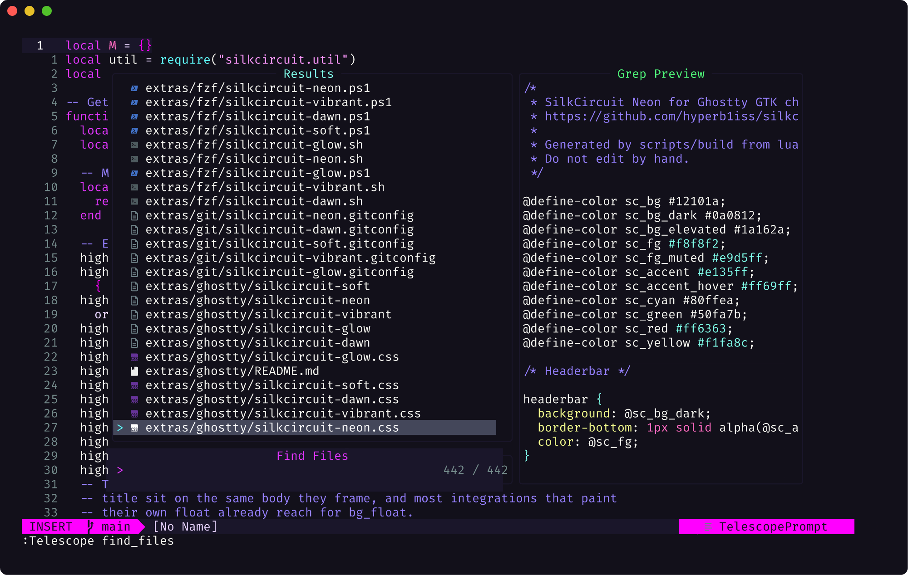
</div>

### 🎪 Configuration

```lua
require("silkcircuit").setup({
  transparent = false,
  terminal_colors = true,
  dim_inactive = false,
  variant = "neon",       -- "neon" | "vibrant" | "soft" | "glow" | "dawn"

  styles = {
    comments = { italic = true },
    keywords = { bold = true },
    functions = { bold = true, italic = true },
    variables = {},
    strings = { italic = true },
  },

  integrations = {
    telescope = true,     -- all 39 ship enabled; set one false to skip it
    neotree = true,
    notify = true,
    cmp = true,
    mini = true,
  },
})
```

### 🔮 Plugin Support

All 39 integrations are defined up front, whether or not the plugin is installed, so nothing waits on detection. Turn one off with `integrations.<name> = false`.

- 🎯 **Core**: Telescope, Neo-tree, LSP, Treesitter, nvim-cmp, Mason
- 🏃 **Navigation**: Flash, Harpoon, Which-Key, Mini.jump
- 🔧 **Git & Dev**: Gitsigns, Neogit, DAP
- 💎 **UI**: Lualine, BufferLine, Notify, Noice, Alpha, Indent Blankline, Rainbow Delimiters

### 🛸 AstroNvim

```lua
return {
  "AstroNvim/astrocommunity",
  { "hyperb1iss/silkcircuit", name = "silkcircuit" },
}
```

### 🎮 Commands

| Command                    | Description                                  |
| -------------------------- | -------------------------------------------- |
| `:SilkCircuit {variant}`   | Switch variant (neon/vibrant/soft/glow/dawn) |
| `:SilkCircuitContrast`     | Check WCAG contrast compliance               |
| `:SilkCircuitGlow`         | Toggle glow mode (on/off/toggle)             |
| `:SilkCircuitIntegrations` | Show detected plugin integrations            |
| `:checkhealth silkcircuit` | Run diagnostics                              |

## 🌃 Full Ecosystem

SilkCircuit extends far beyond your editor. The [extras guide](https://hyperb1iss.github.io/silkcircuit/extras/) has a page per tool with the install path and the line that turns it on, and [extras/README.md](extras/README.md) is the same thing next to the files.

### 🎨 Color Palette

The neon variant's core roles. The other four remap the same roles to their own values, listed on the [variant pages](https://hyperb1iss.github.io/silkcircuit/variants/).

| Color              | Hex       | Usage                                                                              |
| ------------------ | --------- | ---------------------------------------------------------------------------------- |
| Background         | `#12101a` |                            |
| Foreground         | `#f8f8f2` |                            |
| 💜 Electric Purple | `#e135ff` |  Keywords, primary accents |
| 🌸 Soft Pink       | `#ff99ff` |  Strings                   |
| 💎 Neon Cyan       | `#80ffea` |  Functions, links          |
| 🌺 Hot Coral       | `#ff6ac1` |  Numbers, constants        |
| ⚡ Electric Yellow | `#f1fa8c` |  Classes, types            |
| ✅ Success Green   | `#50fa7b` |  Success, git additions    |
| ❌ Error Red       | `#ff6363` |  Errors, git deletions     |

## 📸 Screenshot Gallery

<details open>
<summary><b>Neovim</b></summary>
<br>

|                                  Syntax Highlighting                                  |                                         Theme Highlights                                          |
| :-----------------------------------------------------------------------------------: | :-----------------------------------------------------------------------------------------------: |
| 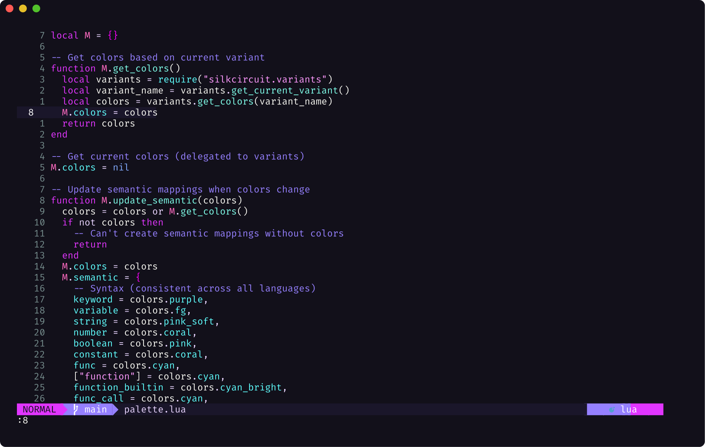 | 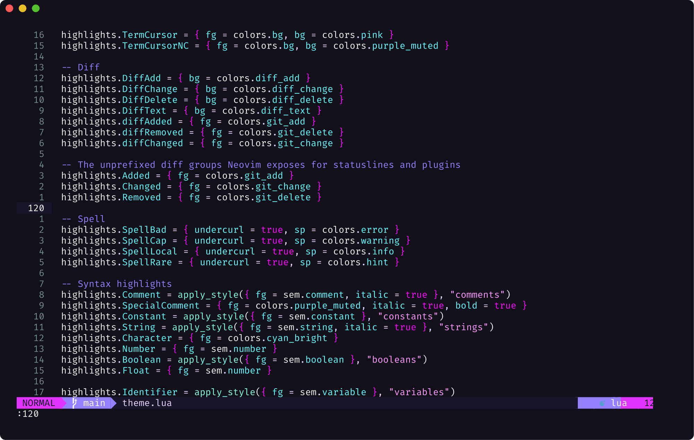 |

</details>

<details open>
<summary><b>Terminal & CLI Tools</b></summary>
<br>

|                               lazygit                                |                                     btop                                      |
| :------------------------------------------------------------------: | :---------------------------------------------------------------------------: |
| 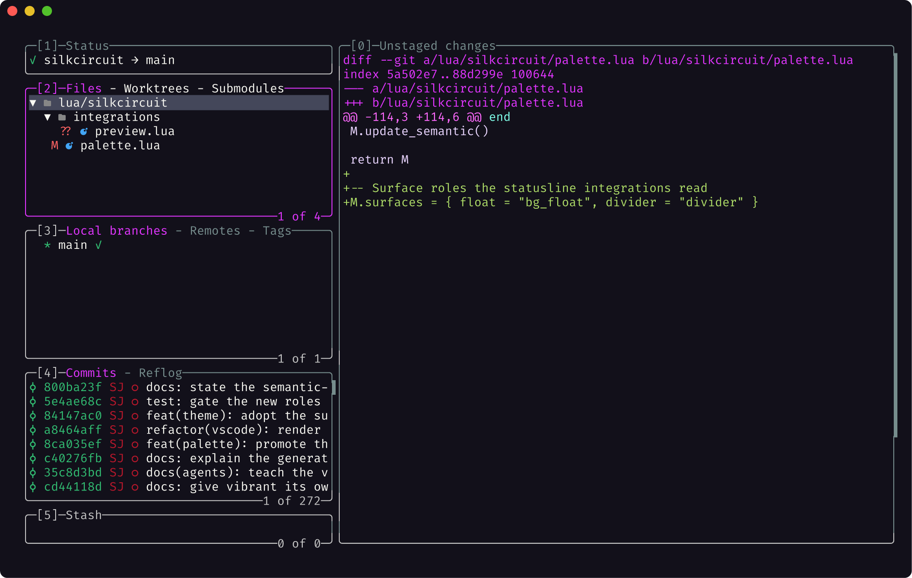 | 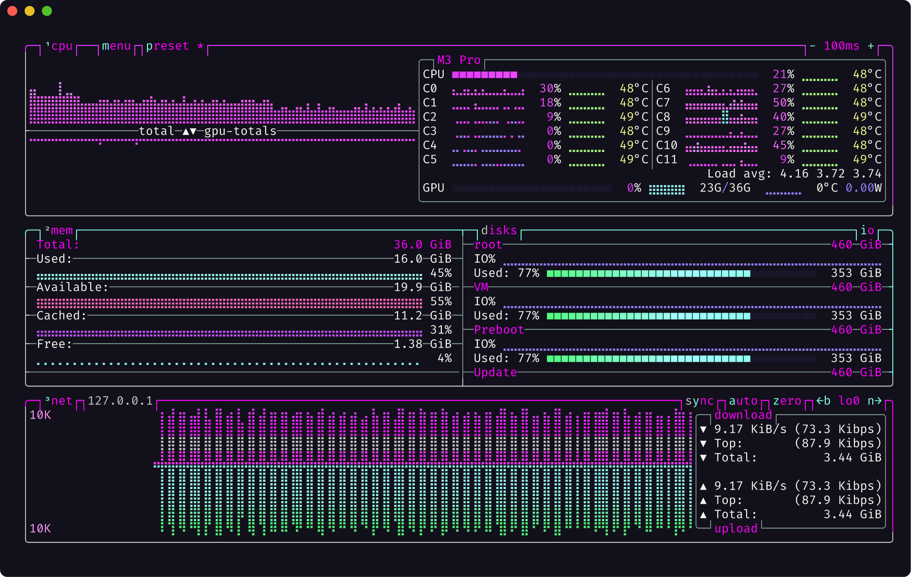 |

|                                    bat                                     |                                      fzf                                      |
| :------------------------------------------------------------------------: | :---------------------------------------------------------------------------: |
| 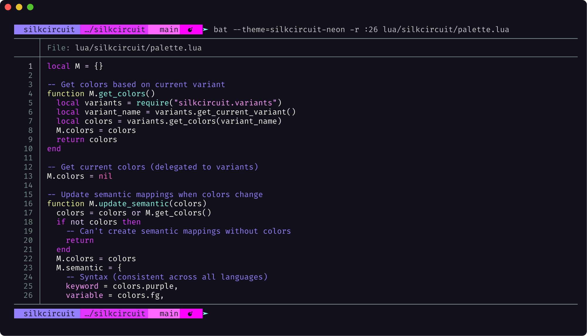 | 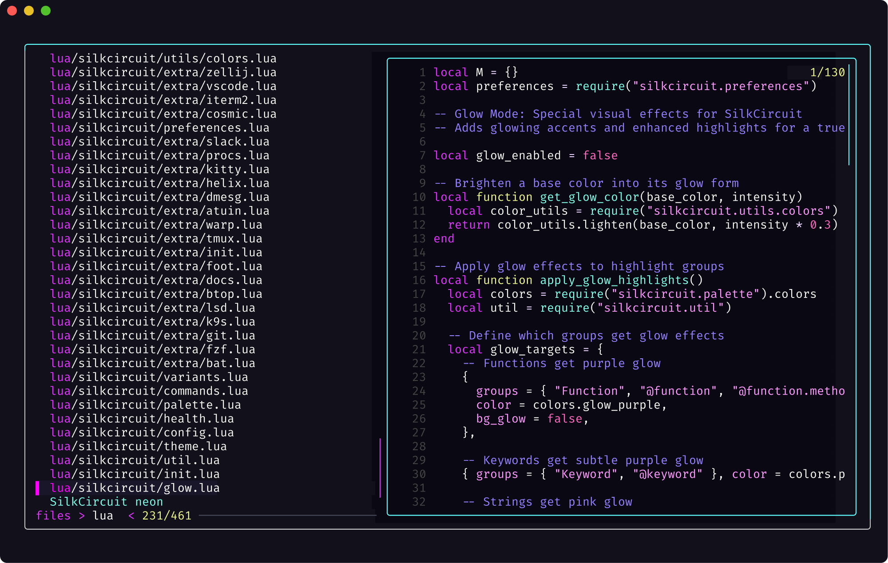 |

|                               git log                                |                                    delta                                     |
| :------------------------------------------------------------------: | :--------------------------------------------------------------------------: |
| 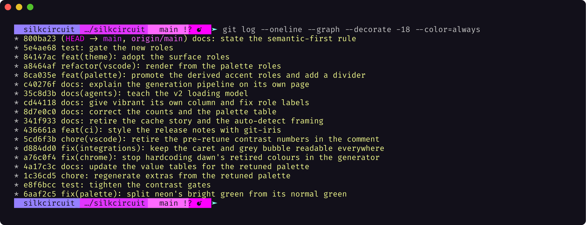 | 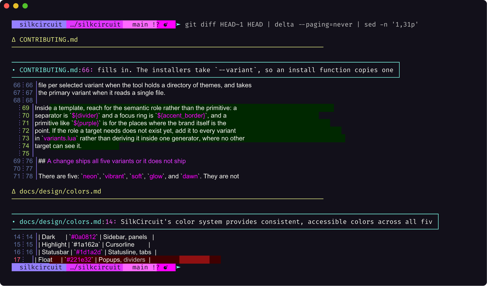 |

|                                      lsd                                       |                                      procs                                      |
| :----------------------------------------------------------------------------: | :-----------------------------------------------------------------------------: |
| 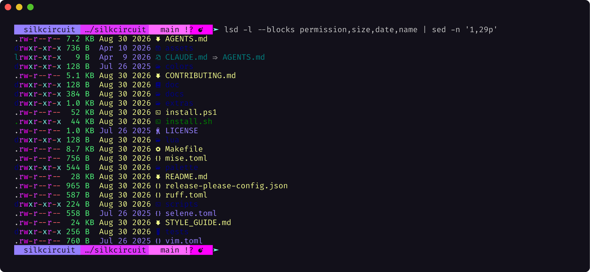 | 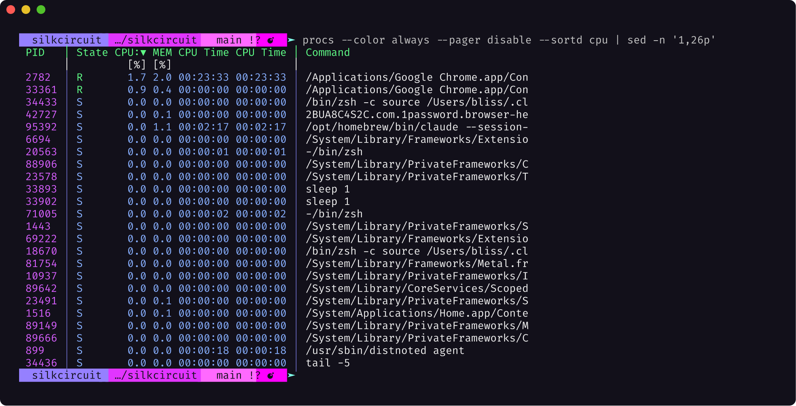 |

|                                      fastfetch                                       |
| :----------------------------------------------------------------------------------: |
| 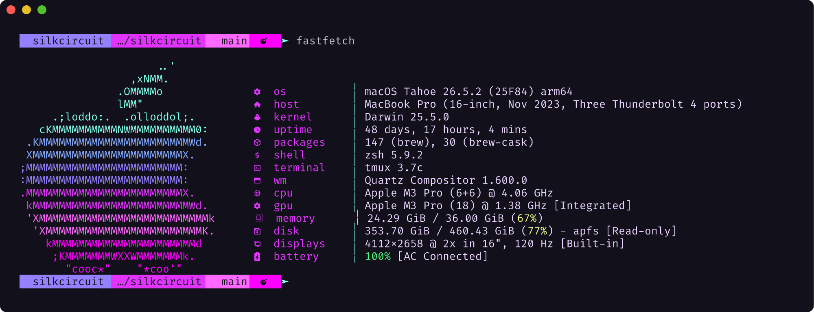 |

</details>

## 🛠️ Troubleshooting

**🤔 Neovim theme not loading?** Requires Neovim 0.10+ with `vim.opt.termguicolors = true`. Run `:checkhealth silkcircuit`.

**🎭 Colors look wrong?** Your terminal must support true colors (24-bit). Try a different terminal emulator if unsure.

**🏎️ Performance issues?** Set `vim.g.silkcircuit_debug = true` and restart to print the measured load time. Anything well over 5ms is worth an issue with your plugin list.

**💭 Need help?** [Open an issue](https://github.com/hyperb1iss/silkcircuit/issues) with your config and error output.

## 💖 Contributing

```bash
git clone https://github.com/hyperb1iss/silkcircuit.git
cd silkcircuit
make setup    # install dev dependencies
make test     # run unit tests
make lint     # check code quality
```

See [STYLE_GUIDE.md](STYLE_GUIDE.md) for the entire SilkCircuit design language.

## 📜 License

MIT License. See [LICENSE](LICENSE) for details.

---

<div align="center">

If you love SilkCircuit, [buy me a Monster Ultra Violet ⚡](https://ko-fi.com/hyperb1iss)

✦ Built with obsession by <a href="https://hyperbliss.tech"><strong>Hyperbliss Technologies</strong></a> ✦

</div>
